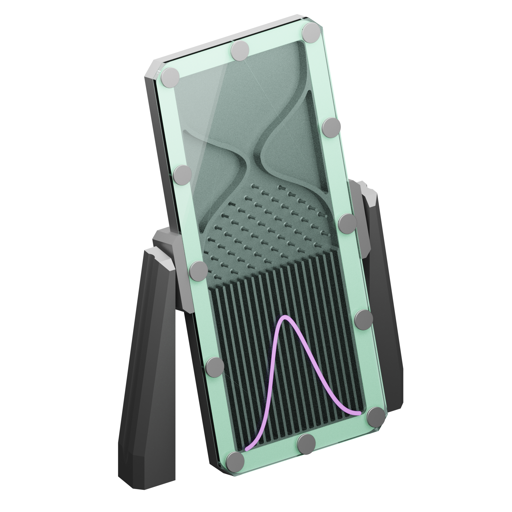
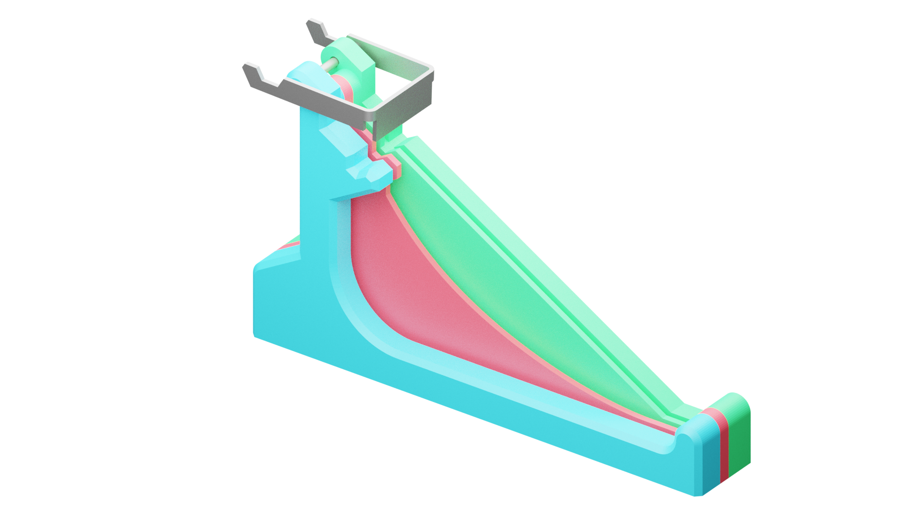
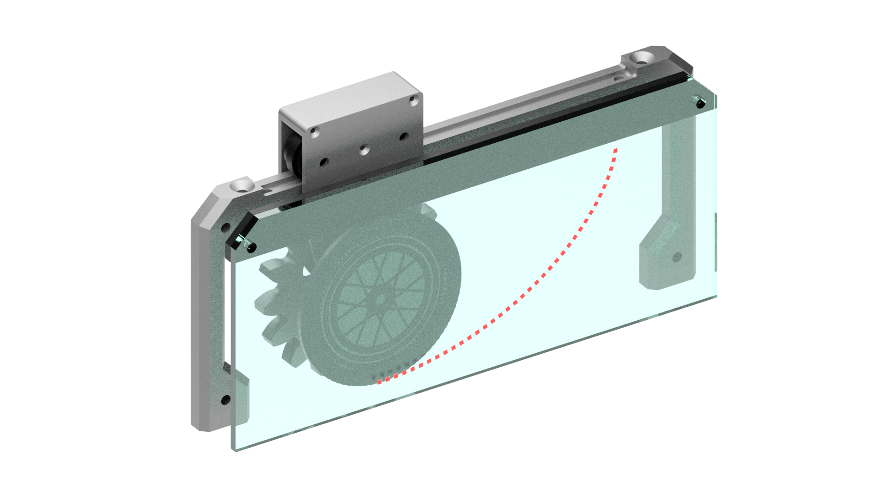

# Mechanics_Demo_Models_UCD
This repository contains the model designs for a "mechanics fun walk" in UCD, for the School of Mechanical and Materials Engineering.
These models demonstrate mechanical concepts for educational and recreational purposes.

Here, you will find:
1. Parts list spreadsheet (for V2 models).
2. Accompanying informational graphics. These include transparent PNG files, which are intended to be printed onto transparent decals or vinyl stickers, and Powerpoint files, which are the accompanying instructions for the models.
3. Explanations document (Digital-explanations.docx). This contains the content to be placed in a webpage which will be linked to through a QR code on the instructional graphic.
4. CAD files for each part and the assembly of each model. The CAD files are included as both STP and the original IPT file. The IPT files can only be opened by Autodesk Inventor 2019 or newer.

There are 9 models designed for a wood and acrylic construction (V1) and 2 models designed for a machined aluminium construction (V2).

These 9 models are:
1. Brachistochrone
2. Galton Board
3. Double Pendulum
4. Coupled Oscillators
5. Nails in a Box (Order from Chaos)
6. Gyroscopic Precession
7. Spontaneous Synchronisation 
8. Tensegrity 
9. Uphill Roller

Of these, the Brachistochrone, Galton Board and double pendulum were designed for machined aluminium.

